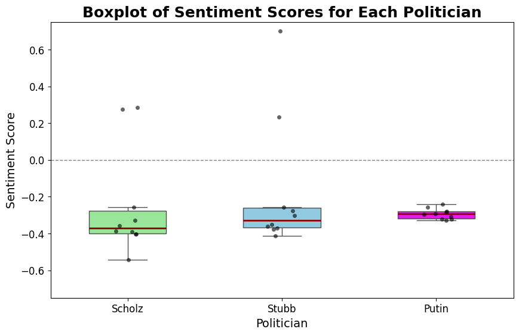
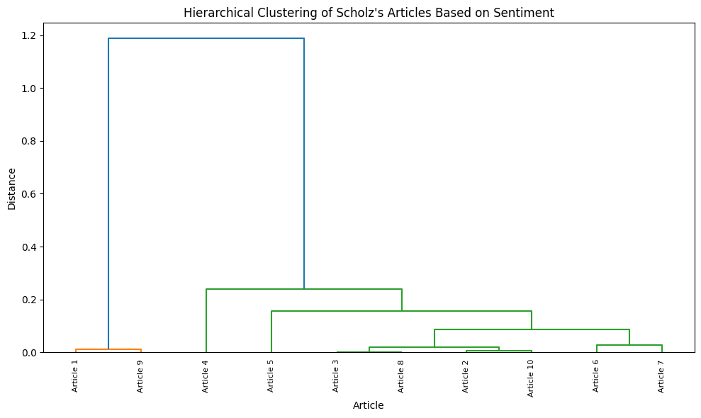
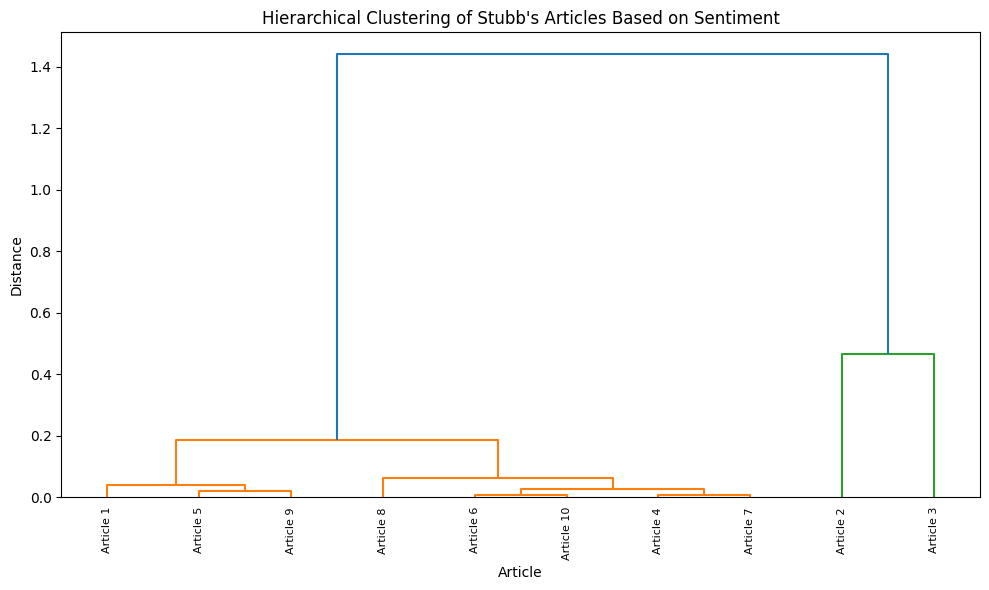
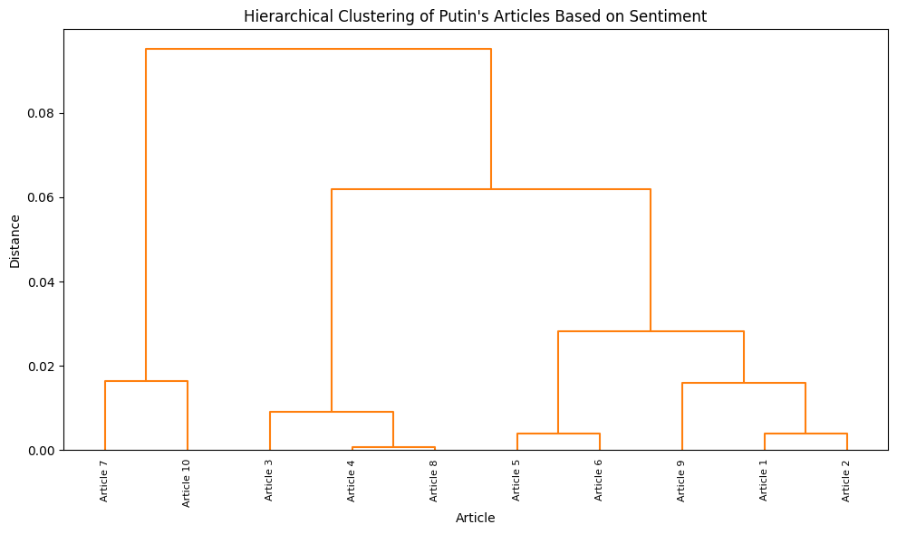

# Sentiment in New York Times Political Coverage

Does the New York Times cover Alexander Stubb, Olaf Scholz and Vladimir Putin
with a measurably different emotional tone — and do a rule-based sentiment tool
and a zero-shot transformer agree about it?

## Findings

- **Every measured article about Putin scored negative.** Under zero-shot
  classification his highest-scoring article still came out at −0.24, so the
  whole sample sits below zero. VADER agrees: 90% of his articles negative, 10%
  neutral, **0% positive**.
- **Stubb drew the widest range and the least negative average.** His mean
  zero-shot score was −0.18 against Scholz's −0.25 and Putin's −0.29, and his
  articles spanned −0.41 to **+0.70** — the highest single score in the dataset.
  By VADER, 40% of his articles were positive against Scholz's 20%.
- **The two methods agree on ranking but not on magnitude.** Both put Putin most
  negative and Stubb least, but VADER labels half of Scholz's and Stubb's
  articles negative while the transformer places most of them only slightly
  below neutral. The rule-based tool is the harsher of the two.
- **Almost nothing is neutral.** Across all three politicians only 10–30% of
  articles landed in VADER's neutral band, which is the project's original
  question: this coverage carries a consistent emotional charge.
- **The clustering is driven by topic, not sentiment.** K-means on TF-IDF split
  the corpus into a Germany/Russia cluster, a Scholz–Putin diplomacy cluster and
  a Trump/election cluster — subject-matter groupings, even though the intent was
  to recover sentiment groups.

## What this was for

Journalism is expected to be neutral, so the question is whether a major outlet's
coverage of individual political figures carries a consistent emotional charge
that a reader would not notice article by article. Anyone studying media bias,
or a communications team tracking how a head of state is portrayed abroad, would
care about the answer.

The Stubb angle is the locally interesting one: this measures how Finland's
president is written about in a major English-language paper, which is not
something a Finnish-language corpus can show. See the limitation below before
reading too much into his numbers.

## Figures



Zero-shot sentiment scores per politician — median, quartiles and outliers.

| | | |
|---|---|---|
|  |  |  |
| Scholz | Stubb | Putin |

Hierarchical clustering (Ward linkage) of articles by sentiment score.

## Method

1. **Collection** — 10 articles per politician via the NYT Article Search API
   (`pynytimes`), published on or after 1 March 2024, the day Stubb took office.
2. **Preprocessing** — HTML stripping (BeautifulSoup), lowercasing, punctuation
   and number removal, stopword removal and tokenisation (nltk).
3. **Sentiment, method 1** — VADER, labelling each article Positive / Negative /
   Neutral on the compound score at ±0.05.
4. **Sentiment, method 2** — zero-shot classification with HuggingFace
   `facebook/bart-large-mnli` over five labels from "strongly negative" to
   "strongly positive", mapped to a −1…+1 scale and scaled by model confidence.
5. **Clustering** — K-means (k=3) on TF-IDF vectors, and hierarchical clustering
   with Ward linkage on the zero-shot scores, visualised as dendrograms.

### Results as measured

| Politician | Mean zero-shot score | Range | VADER negative / neutral / positive |
|---|---|---|---|
| Stubb | −0.178 | −0.415 … +0.700 | 50% / 10% / 40% |
| Scholz | −0.251 | −0.542 … +0.285 | 50% / 30% / 20% |
| Putin | −0.293 | −0.329 … −0.242 | 90% / 10% / 0% |

## Limitations

**Read these before quoting the numbers.**

- **The sample is 10 articles per politician.** The NYT API returns 10 results
  per page and the pagination needed for a larger sample could not be made to
  work, so the intended 100 articles each was cut to 10. Every percentage above
  is therefore a count out of ten.
- **The Stubb sample is largely not about Stubb.** The search query returned
  articles including an obituary for a Four Tops singer, an Nvidia earnings
  preview and an Olympics sustainability piece; only one headline in his ten is
  Finland-related. His scores describe what the query returned, not coverage of
  the president. A constrained query — "Alexander Stubb" as a phrase, or a
  Finland news-desk filter — would be needed to measure that directly.
- **Results are point-in-time.** The notebook pulls live from the API each run,
  so re-running produces a different article set. The committed outputs were
  generated against articles published between March 2024 and late November 2024
  — the sample includes the collapse of Germany's governing coalition and
  references to the US president-elect.
- Sentiment tools score the language of an article, not its factual stance, and
  neither method was validated against human labels on this corpus.

## Tech stack

Python, pandas, numpy, pynytimes, nltk, BeautifulSoup, scikit-learn (TF-IDF,
K-means), vaderSentiment, HuggingFace transformers (`facebook/bart-large-mnli`),
scipy (Ward linkage), matplotlib, seaborn, Jupyter.

## How to run

The repository is a single notebook, `Unsupervised_learning_The_NYT.ipynb`,
written in Google Colab.
[Open in Colab](https://colab.research.google.com/drive/1S79NQYW5LRkmULok6XzpgFJuKPQecaKR?usp=sharing).

```bash
pip install -r requirements.txt
export NYT_API_KEY="your-key"       # free from https://developer.nytimes.com/
jupyter notebook Unsupervised_learning_The_NYT.ipynb
```

The zero-shot step downloads `facebook/bart-large-mnli` (~1.6 GB) on first run
and is much faster on a GPU runtime.

## Data sources

[New York Times Article Search API](https://developer.nytimes.com/), queried for
"Putin", "Stubb" and "Scholz". No article text is committed to this repository.

## Authors

Anastasiia Kosareva and Luis Rheinert.
